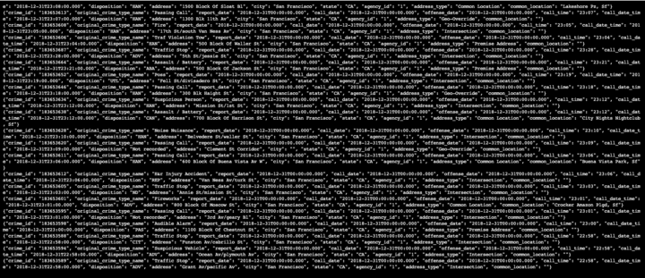
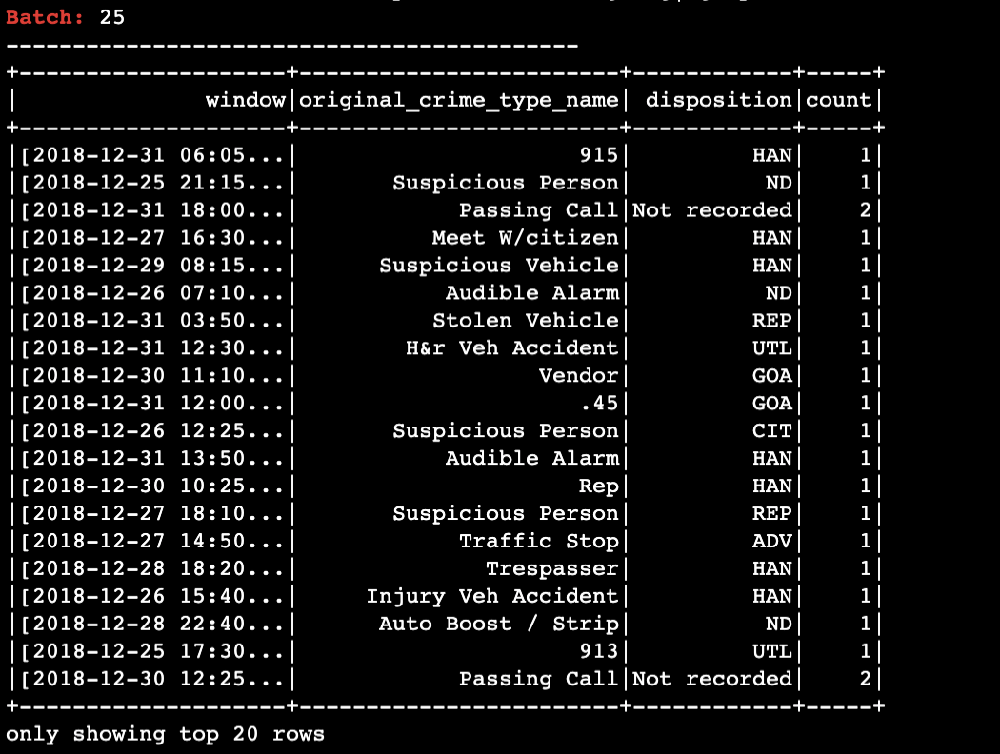
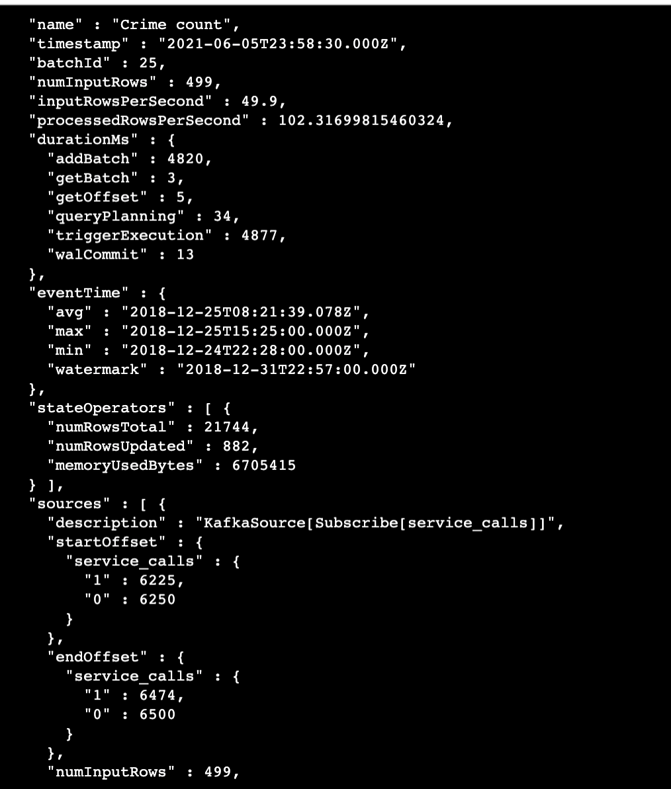
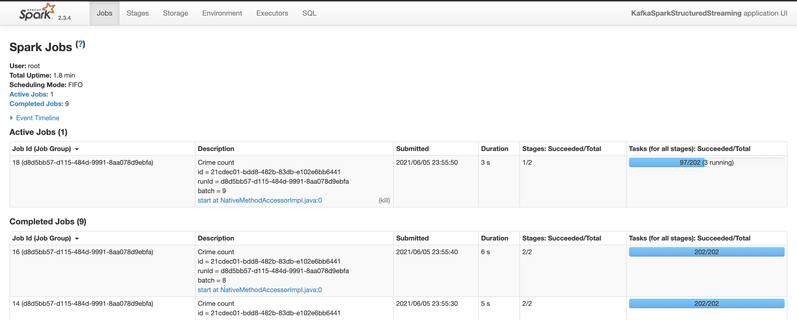

1. How did changing values on the SparkSession property parameters affect the throughput and latency of the data?
It changes `processedRowsPerSecond`,`numInputRows`.

2. What were the 2-3 most efficient SparkSession property key/value pairs? Through testing multiple variations on values, how can you tell these were the most optimal?

- `maxOffsetsPerTrigger` increasing this improved the `processedRowsPerSecond`
- `spark.executor.memory` increasing this also improved the `processedRowsPerSecond` because we had large watermark window so we more memory helped a lot.

## Screenshots
### Kafka Consumer

### Stream Spark DF

### Stream Progress

### Spark UI
